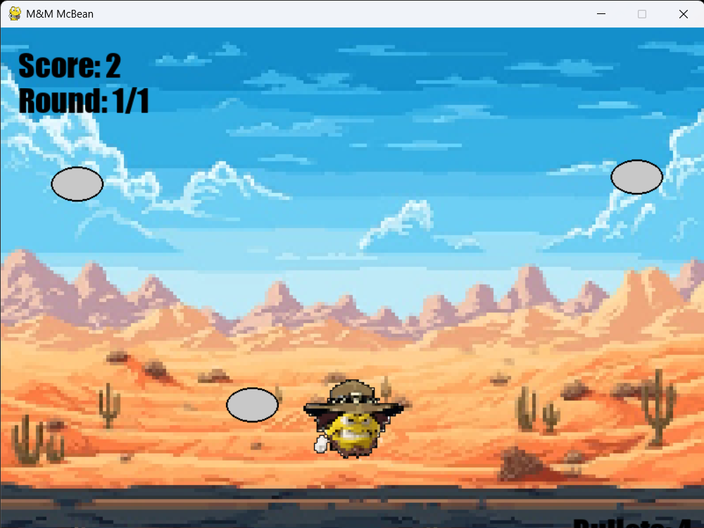

# M&M McBean - Shooting Game

⚠️ **Remember to turn up your speaker volume for the best experience!** 🔊

A pixel-art shooting game built with Python and Pygame where you shoot flying discs.

## 🚀 Quick Start

### Install & Run
```bash
# Activate virtual environment
.venv\Scripts\activate

# Install dependencies
pip install pygame pillow numpy

# Run game
python main.py
```

## 🎮 How to Play

**Objective**: Click on flying plates to shoot them. You have **6 bullets** per round.

**Controls**:
- **MOUSE CLICK**: Shoot at plates
- **SPACEBAR**: Start game / Select menu option
- **UP/DOWN ARROWS**: Navigate menu (in results screen)

**Game Flow**:
```
Intro → Gameplay (click plates) → Results (shows hit ratio X/6) → Restart or Quit
```

## 📸 Game Screenshots


### Gameplay Screen

*Click on flying discs to shoot them - you have 6 bullets per round with hit detection*

## 📁 Required Files

Place these in project root:
- `background_sound.mp3` - Background music (required)
- `shoot.mp3` - Shooting sound (optional)
- `bullet_change.mp3` - Results sound (optional)

## 🎨 Features

- Pixel art visual style (8-bit retro aesthetic)
- 6 bullets per round with hit detection
- Scoring system (shows hit ratio like 4/6)
- Background music and sound effects
- Overwatch-style UI font
- Diagonal parabolic disc trajectories
- Dynamic pixel-art background based on reference image

## ⚙️ System Requirements

- Python 3.8+
- pygame, pillow, numpy
- Windows/macOS/Linux

## 🔧 Troubleshooting

| Issue | Solution |
|-------|----------|
| Game won't start | Install dependencies: `pip install pygame pillow numpy` |
| No audio | Check audio files are in project root; check system volume |
| Game runs slowly | Close other applications |
| IndentationError | Check Python file encoding is UTF-8 |

## 📚 More Info

- `AUDIO_SETUP.md` - Audio configuration guide
- `SOUND_EFFECTS_QUICK_REF.md` - Audio quick reference
- See `main.py` for detailed settings

---

**v1.1.0** | 2025-10-23 | Enjoy the game! 🎯🎮
